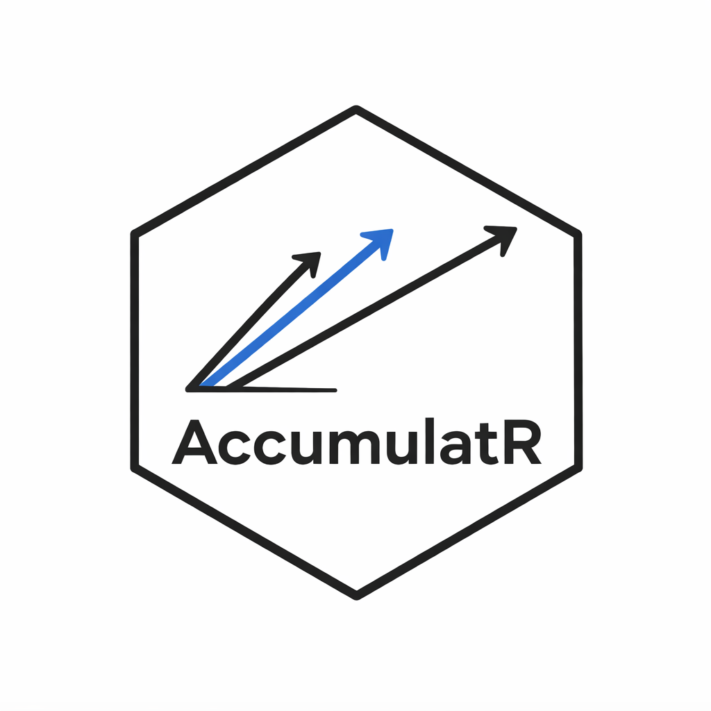

# AccumulatR



`AccumulatR` is an R/C++ toolkit for race-model simulation and likelihood evaluation.

## Installation

``` r
# from a local checkout
remotes::install_github("niekstevenson/AccumulatR")
```

## Small Example

``` r
library(AccumulatR)

spec <- race_spec() |>
  add_accumulator("A", "lognormal") |>
  add_accumulator("B", "lognormal") |>
  add_outcome("A", "A") |>
  add_outcome("B", "B")

model <- finalize_model(spec)

pars <- c(
  A.meanlog = log(0.28), A.sdlog = 0.16, A.q = 0, A.t0 = 0,
  B.meanlog = log(0.35), B.sdlog = 0.18, B.q = 0, B.t0 = 0
)

param_df <- build_param_matrix(spec, pars, n_trials = 8)
sim <- simulate(model, param_df, seed = 123)
head(sim[c("trial", "R", "rt")])

ctx <- build_likelihood_context(model, sim[c("trial", "R", "rt")])
log_likelihood(ctx, param_df)
```

`simulate()` returns trial-level choice/RT data; `log_likelihood()` evaluates the log-likelihood for data under a parameter dataframe.
