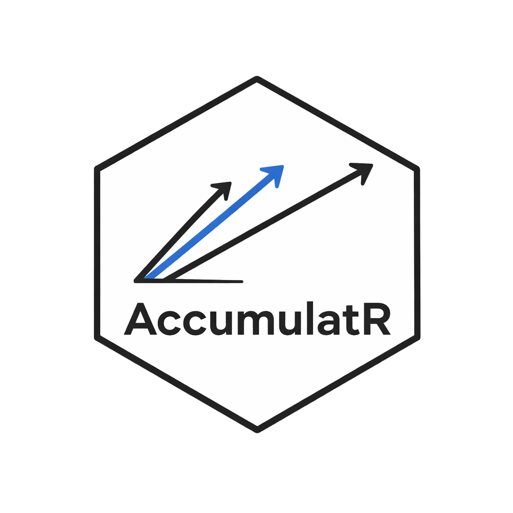

# AccumulatR



`AccumulatR` is an R/C++ toolkit for race-model simulation and
likelihood evaluation.

It is built for the kinds of models cognitive psychologists use when
responses are generated by competing evidence-accumulation processes.
You can define a model, simulate behavioral data, and evaluate how well
different parameter values explain observed response times and choices.

## Installation

AccumulatR is not yet on CRAN. To install the current development
version from GitHub:

``` r
remotes::install_github("niekstevenson/AccumulatR")
```

## What the package does

`AccumulatR` is organized around a simple workflow:

1.  Define a model with accumulators, pools, and observed responses.
2.  Turn that specification into an object ready for simulation or
    fitting.
3.  Simulate behavioral data from known parameter values.
4.  Evaluate the log-likelihood of observed data under candidate
    parameters.

## Small Example

The example below defines a two-choice race model, simulates
response-time data, and then evaluates the likelihood of those same data
under the generating parameters.

``` r
library(AccumulatR)

spec <- race_spec() |>
  add_accumulator("left", "lognormal") |>
  add_accumulator("right", "lognormal") |>
  add_outcome("left", "left") |>
  add_outcome("right", "right")

model <- finalize_model(spec)

pars <- c(
  left.m = log(0.28), left.s = 0.16, left.q = 0, left.t0 = 0,
  right.m = log(0.35), right.s = 0.18, right.q = 0, right.t0 = 0
)

param_df <- build_param_matrix(spec, pars, n_trials = 8)
sim <- simulate(model, param_df, seed = 123)
head(sim[c("trial", "R", "rt")])

prepared <- prepare_data(model, sim[c("trial", "R", "rt")])
ctx <- make_context(model)
log_likelihood(ctx, prepared, param_df)
```

[`simulate()`](https://niekstevenson.github.io/AccumulatR/reference/simulate.md)
returns behavioral data with one row per trial. In the simplest case
that means a response column (`R`) and a response-time column (`rt`).
[`log_likelihood()`](https://niekstevenson.github.io/AccumulatR/reference/log_likelihood.md)
then evaluates how probable those data are under a set of model
parameters.

For longer worked examples, see the package articles on the pkgdown
site.
